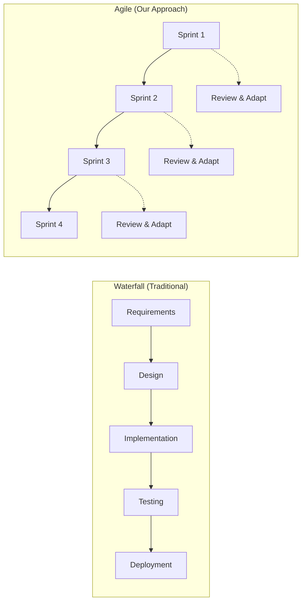
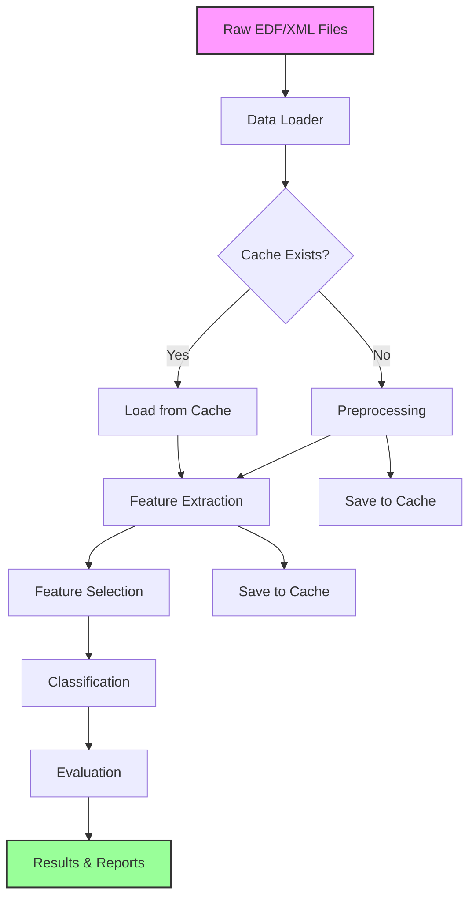
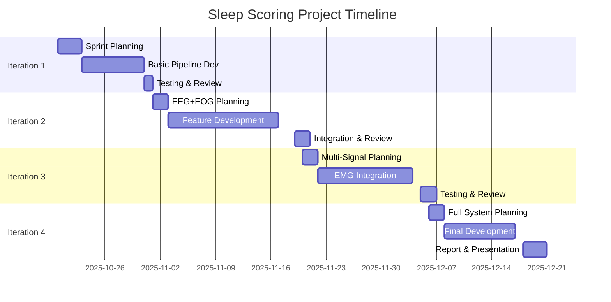
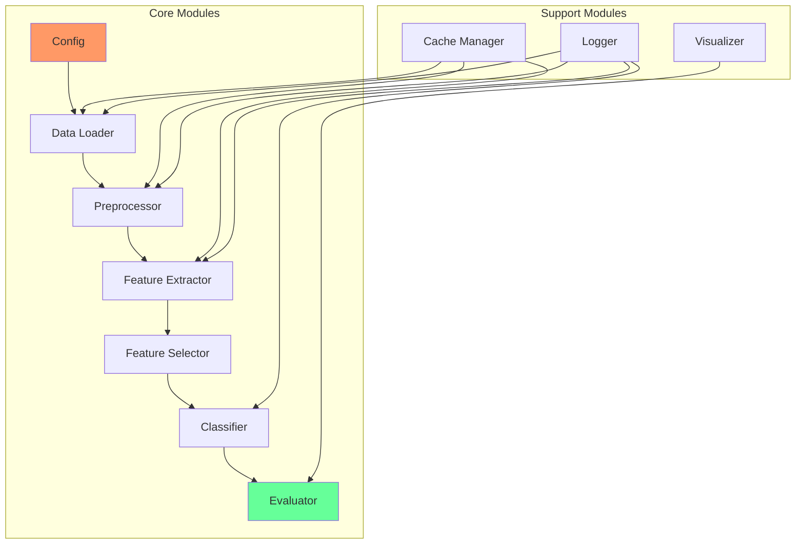

# 📚 Sleep Scoring Project - Complete Guide
## Biomedical Signal Processing (CM2013)

---

## Table of Contents
1. [Project Overview](#project-overview)
2. [Project Management Fundamentals](#project-management-fundamentals)
3. [System Architecture](#system-architecture)
4. [Team Organization](#team-organization)
5. [Development Timeline](#development-timeline)
6. [Technical Implementation](#technical-implementation)
7. [Testing & Quality Assurance](#testing--quality-assurance)
8. [Performance Tracking](#performance-tracking)
9. [Deliverables](#deliverables)
10. [Glossary](#glossary)
11. [ClickUp Guide](#clickup-guide)

---

## 📋 Project Overview

### Goal
Develop an automatic sleep scoring system using multi-signal biosignal processing with iterative improvements over 10 weeks.

### Key Metrics
| Metric | Target | Weight |
|--------|--------|--------|
| Methodology and Code Quality | Modular design, correct pipeline, documentation, testing | 50% |
| Team Collaboration | Regular updates, integration, ClickUp usage | 30% |
| Report & Documentation | Clear technical writing, comprehensive analysis | 20% |

### Learning Objectives
- ✅ Apply signal processing techniques to real biomedical data
- ✅ Implement machine learning classifiers for pattern recognition
- ✅ Practice agile software development in a team
- ✅ Develop professional documentation skills

---

## 🚀 Project Management Fundamentals

### Agile vs. Waterfall Development



### Why Agile for This Project?

| Aspect | Waterfall ❌ | Agile ✅ |
|--------|------------|----------|
| **Feedback** | Only at end | After each iteration |
| **Risk** | High (all-or-nothing) | Low (incremental) |
| **Flexibility** | Rigid plan | Adapt based on results |
| **Testing** | Late discovery of issues | Early problem detection |
| **Learning** | Limited until end | Continuous improvement |

### Sprint Structure

Each sprint (iteration) follows this pattern:

```
┌─────────────────────────────────────────┐
│         SPRINT LIFECYCLE (2.5 weeks)     │
├─────────────────────────────────────────┤
│ Day 1-2:    Sprint Planning              │
│             • Define goals               │
│             • Assign tasks               │
│             • Update ClickUp             │
├─────────────────────────────────────────┤
│ Day 3-15:   Development                  │
│             • Daily standups             │
│             • Code implementation        │
│             • Continuous integration     │
├─────────────────────────────────────────┤
│ Day 16-17:  Testing & Integration        │
│             • Run full pipeline          │
│             • Fix bugs                   │
│             • Performance evaluation     │
├─────────────────────────────────────────┤
│ Day 18:     Sprint Review                │
│             • Demo to team               │
│             • Document results           │
│             • Plan next sprint           │
└─────────────────────────────────────────┘
```

---

## 🏗️ System Architecture

### High-Level Architecture

```
┌──────────────────────────────────────────────────┐
│                   DATA LAYER                      │
│  ┌──────────┐  ┌──────────┐  ┌──────────┐      │
│  │ EDF Files│  │XML Files │  │  Cache   │      │
│  └──────────┘  └──────────┘  └──────────┘      │
└────────────────────┬─────────────────────────────┘
                     │
┌────────────────────▼─────────────────────────────┐
│               PROCESSING LAYER                    │
│  ┌─────────────┐  ┌──────────────┐              │
│  │Data Loading │  │ Preprocessing│              │
│  └─────────────┘  └──────────────┘              │
│  ┌─────────────┐  ┌──────────────┐              │
│  │  Features   │  │  Selection   │              │
│  └─────────────┘  └──────────────┘              │
└────────────────────┬─────────────────────────────┘
                     │
┌────────────────────▼─────────────────────────────┐
│              INTELLIGENCE LAYER                   │
│  ┌─────────────┐  ┌──────────────┐              │
│  │ Classifiers │  │  Evaluation  │              │
│  └─────────────┘  └──────────────┘              │
└────────────────────┬─────────────────────────────┘
                     │
┌────────────────────▼─────────────────────────────┐
│               PRESENTATION LAYER                  │
│  ┌─────────────┐  ┌──────────────┐              │
│  │   Results   │  │Visualization │              │
│  └─────────────┘  └──────────────┘              │
└───────────────────────────────────────────────────┘
```

### Modular Design Pattern

Each module follows this interface:

```python
# Standard Module Interface
def module_function(input_data, parameters):
    """
    Purpose: Clear description of what module does
    
    Inputs:
        input_data: Type and format specification
        parameters: Configuration dictionary
    
    Outputs:
        output_data: Type and format specification
    
    Example:
        result = module_function(data, {'param1': value})
    """
    # Validate inputs
    # Process data
    # Return outputs
```

### Data Flow Diagram



---

## 👥 Team Organization

### Role Distribution (4-Person Team)

| Role | Primary Responsibilities | Secondary Tasks | ClickUp Tags |
|------|-------------------------|-----------------|--------------|
| **Project Manager** | • Team coordination<br>• ClickUp management<br>• Integration testing<br>• Documentation | • Code reviews<br>• Meeting facilitation | `#management` `#integration` |
| **Preprocessing Lead** | • Signal cleaning<br>• Artifact removal<br>• Filter design<br>• Data validation | • Cache optimization<br>• Performance testing | `#preprocessing` `#filters` |
| **Feature Engineer** | • Feature extraction<br>• Feature selection<br>• Statistical analysis<br>• Feature documentation | • Visualization<br>• Feature importance | `#features` `#analysis` |
| **ML Engineer** | • Classifier implementation<br>• Hyperparameter tuning<br>• Cross-validation<br>• Model evaluation | • Results reporting<br>• Confusion matrices | `#ml` `#classification` |

### Communication Matrix

| Communication Type | Frequency | Platform | Duration | Participants |
|-------------------|-----------|----------|----------|--------------|
| Daily Standup | Daily | ClickUp Comments | 5 min | All |
| Sprint Planning | Per Sprint | Video Call | 1 hour | All |
| Code Review | 2x/week | GitHub PR | 30 min | Pairs |
| Integration Test | Weekly | In-person/Video | 1 hour | All |
| Sprint Review | Per Sprint | Video Call | 30 min | All + Instructor |

---

## 📅 Development Timeline

### 10-Week Sprint Schedule



### Iteration Details Table

| Iteration | Sprint Deadline | Focus | Signals | Features | Classifier | Risk Level |
|-----------|----------------|-------|---------|----------|------------|------------|
| **1** | Oct 31, 2025 | Basic Pipeline | EEG | Time (16) | k-NN | Low |
| **2** | Nov 19, 2025 | Enhanced Processing | EEG+EOG | Time+Freq (31) | SVM | Low |
| **3** | Dec 5, 2025 | Multi-Signal | EEG+EOG+EMG | Selected (30) | RF | Medium |
| **4** | Dec 18, 2025 | Full System | All | Optimized | RF-opt | High |

---

## 💻 Technical Implementation

### Module Dependency Graph



### Feature Extraction Pipeline

| Domain | Feature Count | Examples | Computation Time |
|--------|--------------|----------|------------------|
| **Time** | 16 per channel | Mean, Variance, Hjorth | Fast (< 1s) |
| **Frequency** | 15 per channel | Band powers, Spectral entropy | Medium (2-3s) |
| **Time-Frequency** | 20 per channel | Wavelet coefficients | Slow (5-10s) |

### Classification Algorithms Comparison

| Algorithm | Iteration | Pros | Cons | Hyperparameters |
|-----------|-----------|------|------|-----------------|
| **k-NN** | 1 | • Simple<br>• No training<br>• Good baseline | • Slow prediction<br>• Memory intensive | k (neighbors) |
| **SVM** | 2 | • Good accuracy<br>• Works with high-dim data | • Slow training<br>• Needs tuning | C, kernel, gamma |
| **Random Forest** | 3-4 | • High accuracy<br>• Feature importance<br>• Robust | • Can overfit<br>• Many parameters | n_trees, max_depth |

---

## 🧪 Testing & Quality Assurance

### Testing Strategy

| Test Type | Frequency | Responsibility | Tools |
|-----------|-----------|----------------|-------|
| **Unit Tests** | Per commit | Module owner | MATLAB/pytest |
| **Integration Tests** | Daily | PM | Full pipeline |
| **Performance Tests** | Per iteration | Team | Confusion matrix |
| **Regression Tests** | Per sprint | All | Previous results |

### Code Quality Checklist

- [ ] **Documentation**
  - [ ] Function headers complete
  - [ ] Input/output specs clear
  - [ ] Examples provided
  
- [ ] **Error Handling**
  - [ ] Input validation
  - [ ] Try-catch blocks
  - [ ] Meaningful error messages
  
- [ ] **Performance**
  - [ ] Vectorized operations
  - [ ] Efficient algorithms
  - [ ] Memory management
  
- [ ] **Style**
  - [ ] Consistent naming
  - [ ] Proper indentation
  - [ ] Comments for complex logic

---

## 📊 Performance Tracking

### Iteration Performance Dashboard

| Metric | Iter 1 | Iter 2 | Iter 3 | Iter 4 |
|--------|--------|--------|--------|--------|
| **Overall Accuracy** | ___% | ___% | ___% | ___% |
| **Kappa Score** | ___ | ___ | ___ | ___ |
| **F1 Score (Macro)** | ___ | ___ | ___ | ___ |
| **Processing Time** | ___s | ___s | ___s | ___s |
| **Features Used** | ___ | ___ | ___ | ___ |

### Per-Stage Accuracy Tracking

| Sleep Stage | Baseline | Iter 1 | Iter 2 | Iter 3 | Iter 4 |
|-------------|----------|--------|--------|--------|--------|
| **Wake** | Random: 20% | ___% | ___% | ___% | ___% |
| **N1** | Random: 20% | ___% | ___% | ___% | ___% |
| **N2** | Random: 20% | ___% | ___% | ___% | ___% |
| **N3** | Random: 20% | ___% | ___% | ___% | ___% |
| **REM** | Random: 20% | ___% | ___% | ___% | ___% |

---

## 📦 Deliverables

### Final Submission Checklist

#### Code Repository
- [ ] Complete source code (MATLAB/Python)
- [ ] README with setup instructions
- [ ] Requirements/dependencies documented
- [ ] Example data files
- [ ] Unit tests

#### Documentation
- [ ] Technical report (15 pages max)
- [ ] API documentation
- [ ] User guide
- [ ] Performance analysis

#### Report Structure (15 pages)
1. **Introduction** (1 page)
   - Problem statement
   - Objectives
   
2. **Methods** (3 pages)
   - Signal processing
   - Feature extraction
   - Classification approach
   
3. **Results** (4-5 pages)
   - Performance metrics
   - Confusion matrices
   - Statistical analysis
   
4. **Discussion** (3-4 pages)
   - Interpretation
   - Challenges faced
   - Improvements made
   
5. **Conclusion** (1 page)
   - Summary
   - Future work
   
6. **References** (1 page)

---

## 📖 Glossary

### Project Management Terms

| Term | Definition | Example in Project |
|------|------------|-------------------|
| **Agile** | Iterative development methodology with regular feedback | 4 iterations over 10 weeks |
| **Sprint** | Fixed time period for development cycle | 2.5 weeks per iteration |
| **Standup** | Brief daily status meeting | 5-min ClickUp updates |
| **User Story** | Feature from user's perspective | "As a clinician, I need 75% accuracy" |
| **Backlog** | List of pending tasks | ClickUp "To Do" list |
| **Sprint Planning** | Meeting to define sprint goals | Day 1 of each iteration |
| **Sprint Review** | Meeting to demo results | End of each iteration |
| **Burndown Chart** | Progress visualization | Tasks completed vs. time |
| **Velocity** | Team's completion rate | Features per sprint |
| **MVP** | Minimum Viable Product | Iteration 1 pipeline |

### Technical Terms

| Term | Definition | Relevance |
|------|------------|-----------|
| **EEG** | Electroencephalogram - brain activity | Primary signal for sleep (C3-A2, C4-A1 at 125 Hz) |
| **EOG** | Electrooculogram - eye movements | Detects REM sleep (Left/Right at 50 Hz) |
| **EMG** | Electromyogram - muscle activity | Muscle tone indicator (125 Hz) |
| **ECG** | Electrocardiogram - heart electrical activity | Heart rate variability (125 Hz) |
| **Epoch** | Fixed time segment | 30-second windows |
| **Artifact** | Unwanted signal noise | Must be removed |
| **Bandpass Filter** | Frequency range filter | 0.15-40 Hz for EEG (hardware high-pass 0.15 Hz) |
| **Notch Filter** | Removes specific frequency | 50 Hz powerline |
| **PSD** | Power Spectral Density | Frequency analysis |
| **Hjorth Parameters** | Time-domain EEG features | Activity, mobility, complexity |
| **Kappa Score** | Agreement measure | Accounts for chance |
| **F1 Score** | Harmonic mean metric | Precision-recall balance |
| **Cross-validation** | Model validation technique | Prevents overfitting |

### ClickUp Terms

| Term | Definition | How to Use |
|------|------------|------------|
| **Space** | Top-level container | "CM2013 Project" |
| **List** | Task grouping | "Iteration 1", "Iteration 2" |
| **Task** | Single work item | "Implement bandpass filter" |
| **Subtask** | Task component | "Test on channel 1" |
| **Custom Field** | Additional task info | Priority, Signal Type |
| **Tag** | Task label | #preprocessing, #bug |
| **Assignee** | Task owner | Team member name |
| **Due Date** | Task deadline | Within sprint dates |
| **Status** | Task progress | To Do → In Progress → Done |
| **Comment** | Task discussion | Questions, updates |
| **@Mention** | Notify teammate | @john need help here |

---

## 📊 Available Signals and Data Format

### Signal Information

The EDF files contain multiple physiological signals recorded at different sampling rates:

| Channel | EDF Label | Input 1 | Input 2 | Sampling Rate (Hz) | Hardware Filters (Hz) | Sensor Type |
|---------|-----------|---------|---------|-------------------|----------------------|-------------|
| **Linked EEG** | EEG (sec) | C3 | A2 | 125 | High pass 0.15 | Gold cup electrode |
| **Linked EEG** | EEG | C4 | A1 | 125 | High pass 0.15 | Gold cup electrode |
| **Left EOG** | EOG(L) | EOG(L) | PG1 | 50 | High pass 0.15 | Gold cup electrode |
| **Right EOG** | EOG(R) | EOG(R) | PG1 | 50 | High pass 0.15 | Gold cup electrode |
| **EMG** | EMG | EMG | - | 125 | High pass 0.15 | Gold cup electrode |
| **ECG** | ECG | ECG | - | 125 | High pass 0.15 | Ag/AgCl patch |
| **Thorax** | Thor RES | Thor RES | - | 10 | High pass 0.05 | Respitrace Inductance Plethysmography |
| **Abdomen** | Abdo RES | Abdo RES | - | 10 | High pass 0.05 | Respitrace Inductance Plethysmography |
| **Airflow** | New Air | New Air | - | 10 | High pass 0.05 | ProTech thermistor M325 |
| **Airflow (alt)** | Airflow | Airflow | - | 10 | High pass 0.05 | Compumedics thermistor |
| **SpO2** | SaO2 | SaO2 | - | 1 | - | Nonin XPOD 3011, 8000 sensor |
| **Heart Rate** | H.R. | H.R. | - | 1 | - | Nonin XPOD 3011, 8000 sensor |
| **Position** | Position | Position | - | 1 | High pass 0.05 | Internal mercury gauge |
| **Light** | Light | Light | - | 1 | - | External ambient light sensor |
| **Oximetry Status** | OX STAT | OX STAT | - | 1 | - | Nonin XPOD 3011, 8000 sensor |

### Key Signals for Sleep Scoring

**Primary Signals (Most Important):**
- **EEG (C3-A2, C4-A1)**: Brain activity patterns, primary for sleep stage classification (125 Hz)
- **EOG (Left/Right)**: Eye movements, essential for detecting REM sleep (50 Hz)
- **EMG**: Muscle tone indicator for sleep stages (125 Hz)

**Secondary Signals (Complementary Information):**
- **ECG**: Heart rate variability analysis (125 Hz)
- **Respiration (Thorax/Abdomen)**: Breathing patterns (10 Hz)
- **SpO2 & Heart Rate**: Oxygen saturation and pulse (1 Hz)
- **Airflow**: Breathing flow detection (10 Hz)

### Important Notes on Signal Processing

**Hardware Filtering:**
- EEG, EOG, EMG, ECG signals have hardware high-pass filter at **0.15 Hz**
- Respiration signals have hardware high-pass filter at **0.05 Hz**
- Consider these when designing additional filtering stages

**Sampling Rate Considerations:**
- Different signals have different sampling rates (1-125 Hz)
- You may need to resample or process at native rates
- 30-second epochs translate to different numbers of samples per signal

**Data Format:**
- EDF format stores all signals with metadata
- XML files contain sleep stage annotations (30-second epochs)
- Sleep stages: Wake, N1, N2, N3, REM

---

## 🎯 Success Tips

### For Project Managers
1. **Daily Check**: Review all task statuses
2. **Weekly Report**: Summarize progress
3. **Risk Management**: Identify blockers early
4. **Communication**: Over-communicate is better

### For Developers
1. **Code First**: Get something working
2. **Optimize Later**: Don't perfectonize early
3. **Test Often**: Run pipeline after changes
4. **Document Now**: Not later

### For Teams
1. **Help Each Other**: Share knowledge
2. **Celebrate Wins**: Acknowledge progress
3. **Learn from Failures**: Document what didn't work
4. **Stay Flexible**: Adapt based on results

---

## 📞 Getting Help

### Priority Support Channels

1. **Technical Issues**
   - Check documentation first
   - Ask teammate
   - Post in course forum
   - Contact instructor

2. **Team Issues**
   - Direct conversation
   - PM mediation
   - Instructor intervention

3. **Conceptual Questions**
   - Review lecture materials
   - Consult research papers
   - Office hours

---

## 🏁 Final Checklist

### Week 10 Submission

- [ ] Code repository complete and documented
- [ ] All 4 iterations implemented
- [ ] Performance metrics recorded
- [ ] 15-page report finalized
- [ ] Presentation prepared
- [ ] Individual contributions documented
- [ ] ClickUp project archived
- [ ] Lessons learned documented

---

*Remember: The journey is as important as the destination. Focus on learning, collaboration, and incremental improvement rather than perfect results.*

**Good luck with your project! 🚀**

---
## 💡 ClickUp Guide

### Project Manager Assignment
Each group must designate one member as Project Manager (PM). This person is responsible for:

* Setting up and maintaining ClickUp workspace
* Scheduling team meetings
* Ensuring task updates are current
* Monitoring iteration deadlines
* Communicating with the instructor
* Resolving team conflicts

The PM role can rotate between iterations if the team prefers.

### Group Size and Roles
Please note that groups are composed of 3 members. As there are 4 main roles in the project (as defined in the complete guide), it is expected that at least one member will take on more than one role. Teams should decide on a role distribution that works best for them.

### Using ClickUp for Task Management (Free Version)

#### Initial Setup (Project Manager Responsibility)

1.  **Create Your Workspace**
    *   **Name:** `CM2013_Sleep_Scoring_Group[X]`
    *   Add all team members with edit access.
    *   **MANDATORY:** Add instructor as viewer: `[instructor.email@university.edu]`

2.  **Create Sprint Folders**
    *   📁 Iteration 1: Basic EEG (Due: Oct 31, 2025)
    *   📁 Iteration 2: EEG+EOG (Due: Nov 19, 2025)
    *   📁 Iteration 3: EEG+EOG+EMG (Due: Dec 5, 2025)
    *   📁 Iteration 4: Full System (Due: Dec 18, 2025)
    *   📁 Project Management (Ongoing)

#### Task Organization

Each iteration should have tasks for:

*   📥 Data Loading & Caching
*   🔧 Preprocessing
*   📊 Feature Extraction
*   🤖 Classification
*   📈 Evaluation
*   📝 Documentation

#### Managing Tasks with Tags (Free Version)

Create the following essential tags:

*   **Priority Tags (Color: Red/Yellow/Green):**
    *   🔴 `HIGH`
    *   🟡 `MEDIUM`
    *   🟢 `LOW`
*   **Signal Tags (Color: Blue):**
    *   `#EEG`
    *   `#EOG`
    *   `#EMG`
    *   `#ECG`
*   **Status Tags (Color: Purple):**
    *   `#BLOCKED`
    *   `#NEEDS-REVIEW`
    *   `#BUG`
*   **Component Tags (Color: Orange):**
    *   `#preprocessing`
    *   `#features`
    *   `#classification`
    *   `#documentation`

#### Task Creation Rules

*   **Title format:** `[Component] Specific action`
    *   **Example:** `[Preprocessing] Implement 50Hz notch filter`
*   **Required information:**
    *   Assignee (must have one)
    *   Due date (within iteration)
    *   Priority tag (`HIGH`/`MEDIUM`/`LOW`)
    *   Signal tag (`EEG`/`EOG`/`EMG`)
    *   Description with time estimate

#### Status Workflow

`To Do` → `In Progress` → `Review` → `Testing` → `Complete`

#### Sprint Management Protocol

*   **Sprint Planning (Day 1 of each iteration):**
    *   PM creates all tasks from requirements.
    *   Team meeting to assign tasks.
    *   Add appropriate tags to each task.
    *   Everyone must have a balanced workload.
    *   Use task descriptions for details/decisions.
*   **Daily Standups (via ClickUp comments):**
    *   Each member posts a daily update as a task comment.
    *   **Format:** "Today: [what I did], Tomorrow: [what I'll do], Blockers: [any issues]"
    *   Tag PM if blocked (use `@mention`).
*   **Mid-Sprint Check:**
    *   PM reviews all task statuses.
    *   Look for `#BLOCKED` tags.
    *   Redistribute work if needed.
    *   Comment on the iteration folder with a status summary.

#### Using Free ClickUp Features Effectively

*   **Task Dependencies:**
    *   Link related tasks (available in the free version).
    *   Show which preprocessing must finish before features.
*   **Priority Management:**
    *   Use priority tags consistently.
    *   Sort list view by priority.
    *   Focus on `HIGH` priority first.
*   **Time Tracking (Manual):**
    *   Add estimated hours in the task description.
    *   Update with actual time in comments.
    *   PM tracks total hours per person.
*   **Checklists within Tasks:**
    *   Break complex tasks into subtasks.
    *   **Example for "Implement preprocessing":**
        *   [ ] Load signal
        *   [ ] Apply bandpass filter
        *   [ ] Remove baseline drift
        *   [ ] Test on sample data
        *   [ ] Document parameters

#### Communication Protocol

*   **In ClickUp:**
    *   Task-specific discussion: Task comments
    *   Iteration planning: Folder description
    *   Blockers: Tag with `#BLOCKED` and `@mention` PM
*   **Outside ClickUp:**
    *   Quick coordination: Team chat
    *   Code review: GitHub/GitLab
    *   Weekly sync: Video call

#### Project Manager Checklist

*   **Daily:**
    *   Check for `#BLOCKED` tags.
    *   Verify everyone updated their status.
    *   Respond to `@mentions`.
*   **Weekly:**
    *   Update iteration progress in the folder description.
    *   Tag instructor with a summary comment.
    *   Plan next week's priorities.
    *   Check time estimates vs actuals.
*   **Per Iteration:**
    *   Create the next iteration's tasks.
    *   Archive the completed iteration.
    *   Document lessons learned.
    *   Update accuracy metrics.

#### Red Flags (PM Must Monitor)

*   Task with no updates for 48 hours
*   Multiple `#BLOCKED` tags
*   Uneven task distribution (check assignee filter)
*   No complete tasks by day 3
*   Missing daily updates

#### Grading Checkpoints

The instructor will review your ClickUp at:

*   **October 31, 2025** (Iteration 1 complete)
*   **November 19, 2025** (Iteration 2 complete)
*   **December 5, 2025** (Iteration 3 complete)
*   **December 18, 2025** (Final delivery)

**Instructor Access:** Ensure `[instructor.email@university.edu]` has viewer access from Day 1.

#### Tips for Free Version Limitations

*   Use detailed task descriptions instead of custom fields.
*   Create saved filter views for each person.
*   Use color-coded tags for visual organization.
*   Put the iteration number in the task title if needed.
*   Use task comments for progress updates.

**Remember:** Short iterations mean quick decisions. Focus on working code over perfect code!