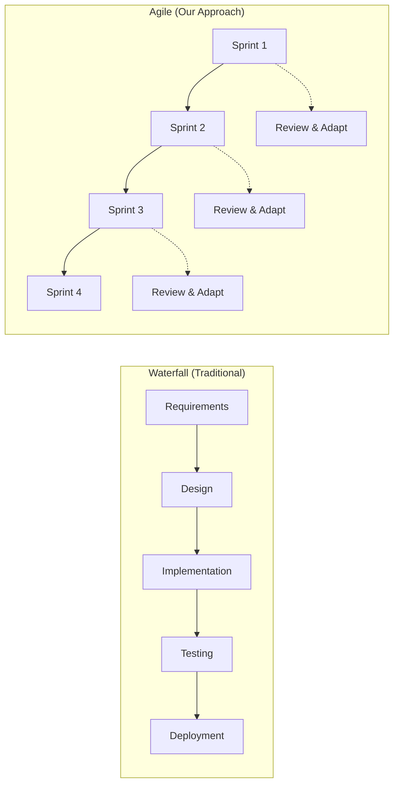
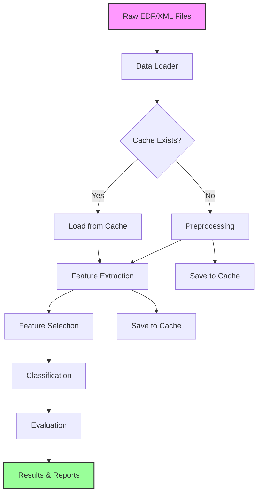
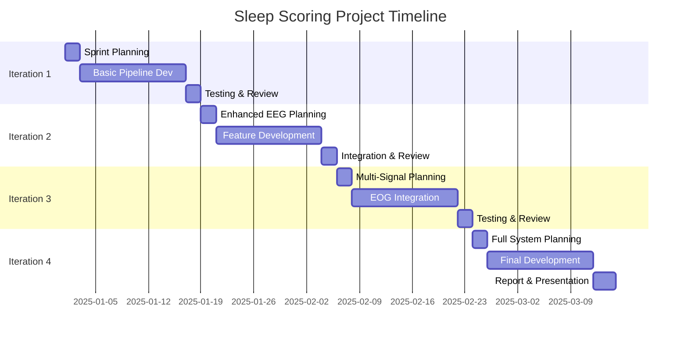
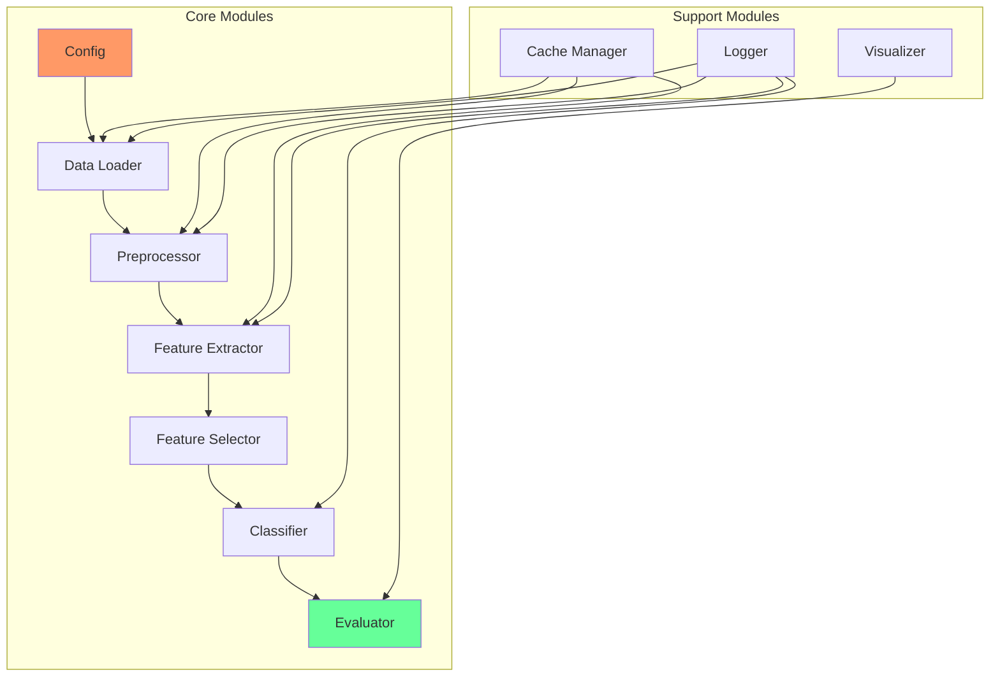

# 📚 Sleep Scoring Project - Complete Guide
## Biomedical Signal Processing (CM2013)

---

## Table of Contents
1. [Project Overview](#project-overview)
2. [Project Management Fundamentals](#project-management-fundamentals)
3. [System Architecture](#system-architecture)
4. [Team Organization](#team-organization)
5. [Development Timeline](#development-timeline)
6. [Technical Implementation](#technical-implementation)
7. [Testing & Quality Assurance](#testing--quality-assurance)
8. [Performance Tracking](#performance-tracking)
9. [Deliverables](#deliverables)
10. [Glossary](#glossary)

---

## 📋 Project Overview

### Goal
Develop an automatic sleep scoring system using multi-signal biosignal processing with iterative improvements over 10 weeks.

### Key Metrics
| Metric | Target | Weight |
|--------|--------|--------|
| Final Accuracy | 75-80% | 40% |
| Code Quality | Modular, documented | 20% |
| Team Collaboration | Regular updates, integration | 20% |
| Report & Documentation | Clear, comprehensive | 20% |

### Learning Objectives
- ✅ Apply signal processing techniques to real biomedical data
- ✅ Implement machine learning classifiers for pattern recognition
- ✅ Practice agile software development in a team
- ✅ Develop professional documentation skills

---

## 🚀 Project Management Fundamentals

### Agile vs. Waterfall Development



### Why Agile for This Project?

| Aspect | Waterfall ❌ | Agile ✅ |
|--------|------------|----------|
| **Feedback** | Only at end | After each iteration |
| **Risk** | High (all-or-nothing) | Low (incremental) |
| **Flexibility** | Rigid plan | Adapt based on results |
| **Testing** | Late discovery of issues | Early problem detection |
| **Learning** | Limited until end | Continuous improvement |

### Sprint Structure

Each sprint (iteration) follows this pattern:

```
┌─────────────────────────────────────────┐
│         SPRINT LIFECYCLE (2.5 weeks)     │
├─────────────────────────────────────────┤
│ Day 1-2:    Sprint Planning              │
│             • Define goals               │
│             • Assign tasks               │
│             • Update ClickUp             │
├─────────────────────────────────────────┤
│ Day 3-15:   Development                  │
│             • Daily standups             │
│             • Code implementation        │
│             • Continuous integration     │
├─────────────────────────────────────────┤
│ Day 16-17:  Testing & Integration        │
│             • Run full pipeline          │
│             • Fix bugs                   │
│             • Performance evaluation     │
├─────────────────────────────────────────┤
│ Day 18:     Sprint Review                │
│             • Demo to team               │
│             • Document results           │
│             • Plan next sprint           │
└─────────────────────────────────────────┘
```

---

## 🏗️ System Architecture

### High-Level Architecture

```
┌──────────────────────────────────────────────────┐
│                   DATA LAYER                      │
│  ┌──────────┐  ┌──────────┐  ┌──────────┐      │
│  │ EDF Files│  │XML Files │  │  Cache   │      │
│  └──────────┘  └──────────┘  └──────────┘      │
└────────────────────┬─────────────────────────────┘
                     │
┌────────────────────▼─────────────────────────────┐
│               PROCESSING LAYER                    │
│  ┌─────────────┐  ┌──────────────┐              │
│  │Data Loading │  │ Preprocessing│              │
│  └─────────────┘  └──────────────┘              │
│  ┌─────────────┐  ┌──────────────┐              │
│  │  Features   │  │  Selection   │              │
│  └─────────────┘  └──────────────┘              │
└────────────────────┬─────────────────────────────┘
                     │
┌────────────────────▼─────────────────────────────┐
│              INTELLIGENCE LAYER                   │
│  ┌─────────────┐  ┌──────────────┐              │
│  │ Classifiers │  │  Evaluation  │              │
│  └─────────────┘  └──────────────┘              │
└────────────────────┬─────────────────────────────┘
                     │
┌────────────────────▼─────────────────────────────┐
│               PRESENTATION LAYER                  │
│  ┌─────────────┐  ┌──────────────┐              │
│  │   Results   │  │Visualization │              │
│  └─────────────┘  └──────────────┘              │
└───────────────────────────────────────────────────┘
```

### Modular Design Pattern

Each module follows this interface:

```python
# Standard Module Interface
def module_function(input_data, parameters):
    """
    Purpose: Clear description of what module does
    
    Inputs:
        input_data: Type and format specification
        parameters: Configuration dictionary
    
    Outputs:
        output_data: Type and format specification
    
    Example:
        result = module_function(data, {'param1': value})
    """
    # Validate inputs
    # Process data
    # Return outputs
```

### Data Flow Diagram



---

## 👥 Team Organization

### Role Distribution (4-Person Team)

| Role | Primary Responsibilities | Secondary Tasks | ClickUp Tags |
|------|-------------------------|-----------------|--------------|
| **Project Manager** | • Team coordination<br>• ClickUp management<br>• Integration testing<br>• Documentation | • Code reviews<br>• Meeting facilitation | `#management` `#integration` |
| **Preprocessing Lead** | • Signal cleaning<br>• Artifact removal<br>• Filter design<br>• Data validation | • Cache optimization<br>• Performance testing | `#preprocessing` `#filters` |
| **Feature Engineer** | • Feature extraction<br>• Feature selection<br>• Statistical analysis<br>• Feature documentation | • Visualization<br>• Feature importance | `#features` `#analysis` |
| **ML Engineer** | • Classifier implementation<br>• Hyperparameter tuning<br>• Cross-validation<br>• Model evaluation | • Results reporting<br>• Confusion matrices | `#ml` `#classification` |

### Communication Matrix

| Communication Type | Frequency | Platform | Duration | Participants |
|-------------------|-----------|----------|----------|--------------|
| Daily Standup | Daily | ClickUp Comments | 5 min | All |
| Sprint Planning | Per Sprint | Video Call | 1 hour | All |
| Code Review | 2x/week | GitHub PR | 30 min | Pairs |
| Integration Test | Weekly | In-person/Video | 1 hour | All |
| Sprint Review | Per Sprint | Video Call | 30 min | All + Instructor |

---

## 📅 Development Timeline

### 10-Week Sprint Schedule



### Iteration Details Table

| Iteration | Weeks | Focus | Signals | Features | Classifier | Target Accuracy | Risk Level |
|-----------|-------|-------|---------|----------|------------|----------------|------------|
| **1** | 1-2.5 | Basic Pipeline | EEG | Time (16) | k-NN | 40-60% | Low |
| **2** | 2.5-5 | Enhanced Processing | EEG | Time+Freq (31) | SVM | 60-70% | Low |
| **3** | 5-7.5 | Multi-Signal | EEG+EOG | Selected (30) | RF | 70-75% | Medium |
| **4** | 7.5-10 | Full System | All | Optimized | RF-opt | 75-80% | High |

---

## 💻 Technical Implementation

### Module Dependency Graph



### Feature Extraction Pipeline

| Domain | Feature Count | Examples | Computation Time |
|--------|--------------|----------|------------------|
| **Time** | 16 per channel | Mean, Variance, Hjorth | Fast (< 1s) |
| **Frequency** | 15 per channel | Band powers, Spectral entropy | Medium (2-3s) |
| **Time-Frequency** | 20 per channel | Wavelet coefficients | Slow (5-10s) |

### Classification Algorithms Comparison

| Algorithm | Iteration | Pros | Cons | Hyperparameters |
|-----------|-----------|------|------|-----------------|
| **k-NN** | 1 | • Simple<br>• No training<br>• Good baseline | • Slow prediction<br>• Memory intensive | k (neighbors) |
| **SVM** | 2 | • Good accuracy<br>• Works with high-dim data | • Slow training<br>• Needs tuning | C, kernel, gamma |
| **Random Forest** | 3-4 | • High accuracy<br>• Feature importance<br>• Robust | • Can overfit<br>• Many parameters | n_trees, max_depth |

---

## 🧪 Testing & Quality Assurance

### Testing Strategy

| Test Type | Frequency | Responsibility | Tools |
|-----------|-----------|----------------|-------|
| **Unit Tests** | Per commit | Module owner | MATLAB/pytest |
| **Integration Tests** | Daily | PM | Full pipeline |
| **Performance Tests** | Per iteration | Team | Confusion matrix |
| **Regression Tests** | Per sprint | All | Previous results |

### Code Quality Checklist

- [ ] **Documentation**
  - [ ] Function headers complete
  - [ ] Input/output specs clear
  - [ ] Examples provided
  
- [ ] **Error Handling**
  - [ ] Input validation
  - [ ] Try-catch blocks
  - [ ] Meaningful error messages
  
- [ ] **Performance**
  - [ ] Vectorized operations
  - [ ] Efficient algorithms
  - [ ] Memory management
  
- [ ] **Style**
  - [ ] Consistent naming
  - [ ] Proper indentation
  - [ ] Comments for complex logic

---

## 📊 Performance Tracking

### Iteration Performance Dashboard

| Metric | Iter 1 | Iter 2 | Iter 3 | Iter 4 | Target |
|--------|--------|--------|--------|--------|--------|
| **Overall Accuracy** | ___% | ___% | ___% | ___% | 75-80% |
| **Kappa Score** | ___ | ___ | ___ | ___ | > 0.7 |
| **F1 Score (Macro)** | ___ | ___ | ___ | ___ | > 0.7 |
| **Processing Time** | ___s | ___s | ___s | ___s | < 60s |
| **Features Used** | ___ | ___ | ___ | ___ | 30-50 |

### Per-Stage Accuracy Tracking

| Sleep Stage | Baseline | Iter 1 | Iter 2 | Iter 3 | Iter 4 |
|-------------|----------|--------|--------|--------|--------|
| **Wake** | Random: 20% | ___% | ___% | ___% | ___% |
| **N1** | Random: 20% | ___% | ___% | ___% | ___% |
| **N2** | Random: 20% | ___% | ___% | ___% | ___% |
| **N3** | Random: 20% | ___% | ___% | ___% | ___% |
| **REM** | Random: 20% | ___% | ___% | ___% | ___% |

---

## 📦 Deliverables

### Final Submission Checklist

#### Code Repository
- [ ] Complete source code (MATLAB/Python)
- [ ] README with setup instructions
- [ ] Requirements/dependencies documented
- [ ] Example data files
- [ ] Unit tests

#### Documentation
- [ ] Technical report (15 pages max)
- [ ] API documentation
- [ ] User guide
- [ ] Performance analysis

#### Report Structure (15 pages)
1. **Introduction** (1 page)
   - Problem statement
   - Objectives
   
2. **Methods** (3 pages)
   - Signal processing
   - Feature extraction
   - Classification approach
   
3. **Results** (4-5 pages)
   - Performance metrics
   - Confusion matrices
   - Statistical analysis
   
4. **Discussion** (3-4 pages)
   - Interpretation
   - Challenges faced
   - Improvements made
   
5. **Conclusion** (1 page)
   - Summary
   - Future work
   
6. **References** (1 page)

---

## 📖 Glossary

### Project Management Terms

| Term | Definition | Example in Project |
|------|------------|-------------------|
| **Agile** | Iterative development methodology with regular feedback | 4 iterations over 10 weeks |
| **Sprint** | Fixed time period for development cycle | 2.5 weeks per iteration |
| **Standup** | Brief daily status meeting | 5-min ClickUp updates |
| **User Story** | Feature from user's perspective | "As a clinician, I need 75% accuracy" |
| **Backlog** | List of pending tasks | ClickUp "To Do" list |
| **Sprint Planning** | Meeting to define sprint goals | Day 1 of each iteration |
| **Sprint Review** | Meeting to demo results | End of each iteration |
| **Burndown Chart** | Progress visualization | Tasks completed vs. time |
| **Velocity** | Team's completion rate | Features per sprint |
| **MVP** | Minimum Viable Product | Iteration 1 pipeline |

### Technical Terms

| Term | Definition | Relevance |
|------|------------|-----------|
| **EEG** | Electroencephalogram - brain activity | Primary signal for sleep |
| **EOG** | Electrooculogram - eye movements | Detects REM sleep |
| **EMG** | Electromyogram - muscle activity | Muscle tone indicator |
| **Epoch** | Fixed time segment | 30-second windows |
| **Artifact** | Unwanted signal noise | Must be removed |
| **Bandpass Filter** | Frequency range filter | 0.5-40 Hz for EEG |
| **Notch Filter** | Removes specific frequency | 50 Hz powerline |
| **PSD** | Power Spectral Density | Frequency analysis |
| **Hjorth Parameters** | Time-domain EEG features | Activity, mobility, complexity |
| **Kappa Score** | Agreement measure | Accounts for chance |
| **F1 Score** | Harmonic mean metric | Precision-recall balance |
| **Cross-validation** | Model validation technique | Prevents overfitting |

### ClickUp Terms

| Term | Definition | How to Use |
|------|------------|------------|
| **Space** | Top-level container | "CM2013 Project" |
| **List** | Task grouping | "Iteration 1", "Iteration 2" |
| **Task** | Single work item | "Implement bandpass filter" |
| **Subtask** | Task component | "Test on channel 1" |
| **Custom Field** | Additional task info | Priority, Signal Type |
| **Tag** | Task label | #preprocessing, #bug |
| **Assignee** | Task owner | Team member name |
| **Due Date** | Task deadline | Within sprint dates |
| **Status** | Task progress | To Do → In Progress → Done |
| **Comment** | Task discussion | Questions, updates |
| **@Mention** | Notify teammate | @john need help here |

---

## 🎯 Success Tips

### For Project Managers
1. **Daily Check**: Review all task statuses
2. **Weekly Report**: Summarize progress
3. **Risk Management**: Identify blockers early
4. **Communication**: Over-communicate is better

### For Developers
1. **Code First**: Get something working
2. **Optimize Later**: Don't perfectonize early
3. **Test Often**: Run pipeline after changes
4. **Document Now**: Not later

### For Teams
1. **Help Each Other**: Share knowledge
2. **Celebrate Wins**: Acknowledge progress
3. **Learn from Failures**: Document what didn't work
4. **Stay Flexible**: Adapt based on results

---

## 📞 Getting Help

### Priority Support Channels

1. **Technical Issues**
   - Check documentation first
   - Ask teammate
   - Post in course forum
   - Contact instructor

2. **Team Issues**
   - Direct conversation
   - PM mediation
   - Instructor intervention

3. **Conceptual Questions**
   - Review lecture materials
   - Consult research papers
   - Office hours

---

## 🏁 Final Checklist

### Week 10 Submission

- [ ] Code repository complete and documented
- [ ] All 4 iterations implemented
- [ ] Performance metrics recorded
- [ ] 15-page report finalized
- [ ] Presentation prepared
- [ ] Individual contributions documented
- [ ] ClickUp project archived
- [ ] Lessons learned documented

---

*Remember: The journey is as important as the destination. Focus on learning, collaboration, and incremental improvement rather than perfect results.*

**Good luck with your project! 🚀**
